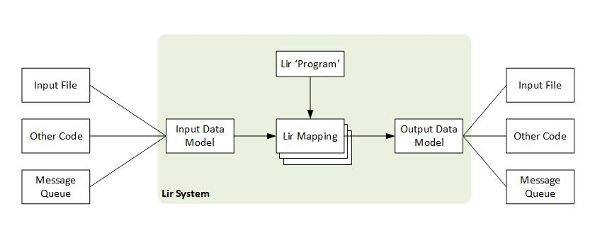

# Lir

*A language for describing the conversion of data in one schema into another.*

CSE P 590 wi21 Final Project - Pat Leahy - patleahy@uw.edu 

* HW5.3 Specification: https://docs.google.com/document/d/1tCTTs3S26qWGabqUhrtquPn9vYZ-NTc3pHqQ6oVPg6U/edit
* HW5.2 Pre-Proposal: https://docs.google.com/document/d/1CjqzdFDgl1bzQAXJ8aX-fIM69zMkuVQhIi-Fin2XjL4/edit#

---

## The Design Document

### Part 1. Your language

> Summarize key objects, types, and operators of your language:
> 
> * select those constructs that are important for presenting your design
> * illustrate features with example programs in your language
> * highlight those constructs that make your language a better solution to the problem than a classical library of procedures or classes

The Lir language is used to describe how a data model in one schema is transformed into a data model in a different schema. The key construct is a *mapping rule*. A mapping rule describes how an object of the input data model is transformed into an object in the output data model. A mapping rule has a *pattern* which specifies which input objects the mapping rule applies to. The mapping rule also has a *production* which is the object which specifies which object in the output data model should be be created when the rule matches to an object in the input. 

The simplest mapping rule is declared like this:
```ts
lir.map('input_pattern').to('output_pattern');
```

`map('input_pattern')` specifies the pattern and `to('output_pattern')` specifies the production.

If the mapping rule doesn't have *child mapping rule* then the input object's properties are copied to the output object.

*child mapping rules* are specified using the `with` and `and` fluent methods. When a mapping rule has child rules then the input object's properties are not copied to the output object. Instead an empty output object is created. The child rules are applied within the scope of the input and output objects. 

#### Example

[TCX (Training Center XML)](https://en.wikipedia.org/wiki/Training_Center_XML) and [GPX (GPS Exchange Format)](https://www.topografix.com/gpx.asp) are two file formats for saving data from GPS devices such as cycle computers and running watches. Here is a simplified example of the same bike ride deserialized into TypeScript from both a TCX and GPX file. To see how the TypeScript literals were generated from XML files, see [the examples directory](examples/README.md).

*GPX Example:*
```ts
{
  "gpx": {
    "trk": {
      "name": "Gravel ride from Arcadia Beach",
      "trkseg": {
        "trkpt": [
            {
              "@_lat": "45.839295",
              "@_lon": "-123.959679",
              "ele": 47.660132,
              "time": "2020-08-05T05:09:48Z"
            },
            {
              "@_lat": "45.8385559",
              "@_lon": "-123.959732",
              "ele": 47.660132,
              "time": "2020-08-05T05:10:29Z"
            },
            {
              "@_lat": "45.838526",
              "@_lon": "-123.958723",
              "ele": 50.549016,
              "time": "2020-08-05T05:11:08Z"
            },
            // ...
```

*TCX Example*
```ts
{
  "TrainingCenterDatabase": {
    "Courses": {
      "Course": {
        "Track": {
          "Trackpoint": [
            {
              "Time": "2020-08-05T05:09:48Z",
              "Position": {
                  "LatitudeDegrees": 45.839295,
                  "LongitudeDegrees": -123.959679
              },
              "AltitudeMeters": 47.660132,
              "DistanceMeters": 0
            },
            {
              "Time": "2020-08-05T05:10:29Z",
              "Position": {
                  "LatitudeDegrees": 45.8385559,
                  "LongitudeDegrees": -123.959732
              },
              "AltitudeMeters": 47.660132,
              "DistanceMeters": 82.37836619887925
            },
            // ...
```

The `trkpt` and `Trackpoint` arrays in each data model contain waypoints, i.e. the location of the GPS device at a point in time. The Lir language could be used to map the `trkpt` objects to `Trackpoint` objects using a mapping rule declared like this:

```js
  var map = lir
      .from('gpx.trk.trkseg.trkpt')
      .to('TrainingCenterDatabase.Courses.Course.Track.Trackpoint')
        .with("@_lat").to("Position.LatitudeDegrees")
        .and("@_lon").to("Position.LongitudeDegrees")
        .and("time").to("Time")
        .and("ele").to("AltitudeMeters")

  var output = map(input);
```

In this example the `from` method specifies a pattern to match. The pattern is described in a dot delimited notation inspired by the [jQ language](https://stedolan.github.io/jq/). When this pattern matches an object in the input data model the production described in the `to` method is used. This will create the nested objects described in the `to` argument, unless they were already created by a previous rule. In this example, there are sub-rules specified inside the scope of the object matched. `with` and `and` are patterns which match to objects inside the scope of `gpx.trk.trkseg.trkpt`. These sub-rules have simple productions which simply copy the value from the matched property to the property specified in using the `to` argument. The properties in the `to` arguments are relative to the `TrainingCenterDatabase.Courses.Course.Track.Trackpoint` object.

Note that the matched object `gpx.trk.trkseg.trkpt` is an array. When a pattern matches an array then the result of the output of the projection is created for each item in the array.

The `DistanceMeters` property in the output data model is a running total of the distance of the route. There is no property in the input which can be mapped directly to this property, however it can be calculated. To give people the ability to do custom transformations, the Lir language will allow a function to be specified which can modify the value of properties. Here the `using` method is used to add a custom function which calculates the value to be put in the `DistanceMeters` property:

```js
  // Code using the Lir DSL
  map.from('gpx.trk.trkseg.trkpt').using(calcDistance).to('DistanceMeters');

  // Declaration of the calcDistance function used in the mapping rule above.
  var distance = 0.0;
  var prevPoint = undefined;
  function calcDistance(point) {
      if (prev) {
        distance += haversine(prev['@_lat'], prev['@_lon'], point['@_lat'], point['@_lon']);
      }
      prev = point;
      return distance;
  }
```

A benefit of Lir over simply writing code to copy properties from the input data model to the output data model is that Lir code is a lot more readable. The Lir *runtime* takes care of traversing the models, creating hierarchies of objects and comparing property names to expected names. The Lir code is very little more than a declaration of the desired mappings.

The XSLT (Extensible Stylesheet Language Transformations) has also many of the same benefits of Lir. It proves a highly expressive syntax to specificizing mapping between data models using a declarative language. However, I believe that Lir is easier to read for an number reasons. XSLT is embedded in XML and that syntax makes it hard to read. Lir makes the hierarchies of the input and output models more explicit than XSLT. Lastly, Lir can be debugged using the same debugging tools as the program it is used within. XSLT debugging tools are often not familiar to the developers requiring this kind of functionality.

### Part 2. Your implementation

> Describe the chosen implementation.  Answer at least these questions:
> 
> Will your language be embedded (if yes, shallow or deep) or external, or will it be a combination of the above designs?
> * The components could be a parser, analyzer, code generator, etc.
> * The data could be an AST, a CFG, or other IR, etc.

The Lir language is a combination of a shallow and deep embedding of the TypeScript language. The mapping rules are declared using chained fluent methods. 

The patterns could be thought of as a very small deep embedding. In this example from above:
```ts
  lir
      .from('gpx.trk.trkseg.trkpt')
      .to('TrainingCenterDatabase.Courses.Course.Track.Trackpoint')
```
The strings `gpx.trk.trkseg.trkpt` and `TrainingCenterDatabase.Courses.Course.Track.Trackpoint` are the embedded patterns. I can tokenize and use these dot delimited property names within the fluent methods by simply using the TypeScript `split` method. If I have to extend the design to use more complex patterns then I could either implement a parser for these strings or add additional fluent methods to augment the shallow embedding to handle the new use cases.

> Will your system use an optimizer?

Lir will not use an optimizer.

> Will you analyze the code to find some errors?

I will take advantage of strong typing in TypeScript when implementing the fluent methods so that syntactically incorrect Lir rules will not compile. 

> What is your implementation language?

TypeScript.

> How will you test the implementation of your language?

I will use unit tests modeled on real world scenarios to demonstrate that mapping rules create the expected output.

> What compiler construction tools (such as ANTLR) will you use?

As a shallow embedding the only tools I will use are typical tools for implementing TypeScript programs, e.g. tsc, npm.

> Answer other questions as necessary.  For example, you may need to answer what is your compiler’s target language or API.

> Add a figure of **your implementation architecture** and refer to it from your answers.

This diagram shows how the Lir system is intended to operate. Creating the input data model and using the output data model are outside the scope of the Lir system. The *Lir Program* is the code which declares the mapping rules. 



This code example shows how these components appear in code:

```ts
  // Start of Lir `Program`

  var lirMappings = Lir
      .form('pattern').to('output')
        .with('child_pattern').to('child_output')
        // ...
  
  // Additional rules can be added
  lirMappings.form('new_oattern').to('new_output')
      // ...

  // End of Lir `Program`

  // lirMappings contain the `Lir Mappings`

  // Using the Lir Mappings to transform an input file format to an output file format:
  
  var input = read(in_filename);
  var output = lirMappings.run(input);
  write(out_filename, output);
```

### Part 3. Design Rationale and Design Alternatives

> Present justification for your design choices.  For all the answers to Part 2, describe why this was the best choice. You should account for the short implementation time, and explain why given more time, you may have chosen a different option.

I chose an embedded DSL so that I could concentrate on implementing the mapping functionality. I picked a strongly typed language so that I could take advantage of the type system to prevent many syntax errors in the DSL. This DSL could be implemented in any languages which have support for objects. I chose TypeScript because I was familiar with implement fluent DSLs the language after the previous homework. 

An advantage of using an embedded DSL is that it is easy to inject custom transformations, as in the example of generating the `DistanceMeters` property above.

I chose to use dot delimited strings instead of using additional fluent methods to specify the patterns for brevity. If the input data model was strongly typed then the mapping rules could take advantage of the types to be simpler to declare. A strongly typed data model could be created if a XML file was deserialized into a model using a XSD, for example. However, my language is designed for a dynamic deserialization where the input data types are simple object.

There are two considerations when deciding to use an optimizer. Firstly, could an optimizer improve some useful metric? It is possible that one rule could overwrite the output of another rule. Eliminating the earlier rule could reduce some runtime. The second question is could I optimize rules while maintaining the same mappings? I decided this could be possible in specific cases, but it would be difficult to ensure the optimizations were safe. I therefore decided “premature optimization is the root of all evil”. 

Operating on in-memory representation requires the programmer to write additional code when using Lir with files as compared with using XSLT. I believe there are benefits to this decision. Keeping file i/o outside the system ensures that Lir is agnostic to file types; it doesn't matter if the data came from XML, Json, Yaml, or even binary files which are loaded into memory structures. It can also be used with data read from message queues or databases which support hierarchical data structures such as GraphGL databases.

### Part 4. Implementation steps

> Describe your implementation plan.  Design your implementation steps such that each step adds more features from your language, so that when you run out of time, you will have some subset of your language running.  Ideally, you will be able to execute some simple programs from your language already after the first step.

I intend to build Lir to support mapping between two pairs of in-memory representations of well known XML file types. I want to be able to transform a deserialized RSS file into the same data model as could represent an Atom file. Secondly I want to be able to transform a TCX (Training Center XML) model to a GPX (GPS Exchange Format) model. Both pairs of file types provide real world examples, and both have structures small enough that I can create Lir language to implement the mappings. Examples of these file types along with their structure when loaded into TYpeScript are shown in [the examples directory](examples/README.md).

> Show at least three steps.  For each step, describe what programs in your language you will be able to run after this step is implemented.

Here are steps I intend to follow:

| Step  | Description                                        | Fluent Method                 |
| :---: | -------------------------------------------------- | ----------------------------- |
|   1   | Simple mapping from one property to another.       | `from` and `to`               |
|   2   | Simple mapping from one array property to another. |                               |
|   3   | Mapping with one child mapping.                    | `with`                        |
|   4   | Mapping with more than one child mapping.          | `and`                         |
|   5   | Mapping child nested inside another child.         | `with` inside `with` or `and` |
|   6   | Custom transformations                             | `using`                       |
